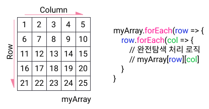
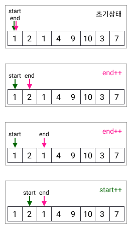
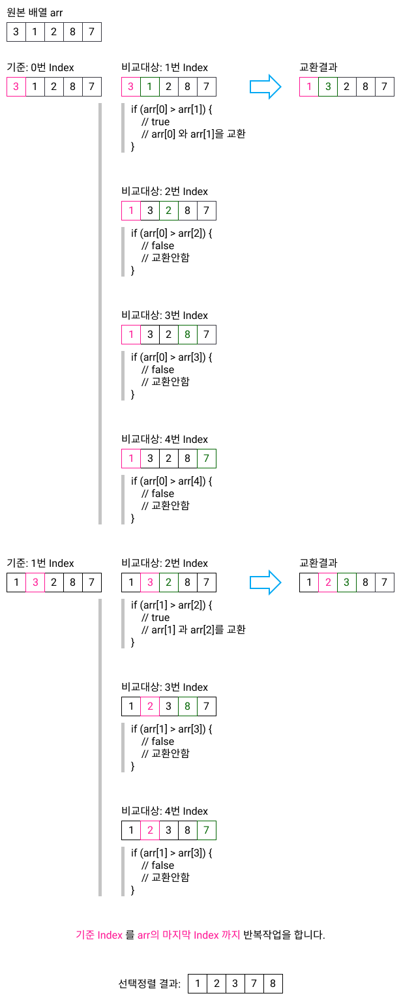
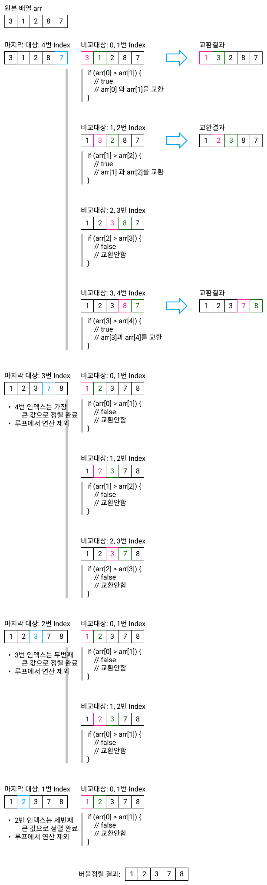
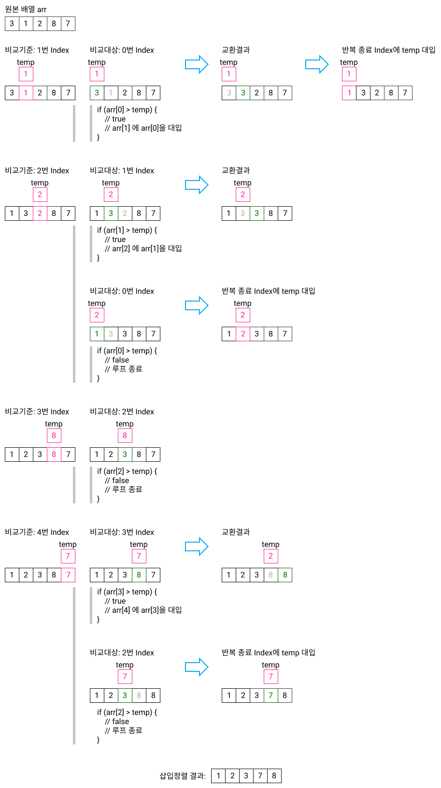
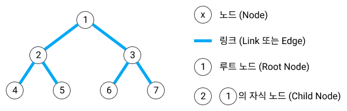

##### top
# Algorithm 스터디

Javascript 를 사용한 알고리즘 스터디 저장소 입니다.


<br/>

# 목차

01. [Javascript API 정리](#01)

    * [01-01. ``Number.MAX_SAFE_INTEGER``](#01-01)
    * [01-02. ``Number.MIN_SAFE_INTEGER``](#01-02)
    * [01-03. ``Array객체.reduce(callback[, 초기값]): 최종누적값``](#01-03)
    * [01-04. ``String값.split()``](#01-04)
    * [01-05. ``String값.slice()``](#01-05)
    * [01-06. ``String값.substring()``](#01-06)
    * [01-07. ``RegExp`` 생성자 함수](#01-07)
    * [01-08. ``String값.match()``](#01-08)
    * [01-09. ``Array객체.map()``](#01-09)
    * [01-10. ``Set``](#01-10)
    * [01-11. ``Map``](#01-11)
    * [01-12. ``배열의 구조분해``](#01-12)
    * [01-13. 배열의 구조분해 ``초기값`` 설정](#01-13)
    * [01-14. 배열의 구조분해 중 ``일부값 무시하기``](#01-14)
    * [01-15. ``객체의 구조분해``](#01-15)

<br/>

2.  [알고리즘 정리](#02)

    * [02-01. ``브루트포스 (Brute Force)`` - 완전탐색](#02-01)
    * [02-02. ``투 포인터 (Two Pointer)``](#02-02)
    * [02-03. ``슬라이딩 윈도우 (Sliding Window)``](#02-03)
    * [02-04. ``선택정렬 (Selection Sort)``](#02-04)
    * [02-05. ``버블정렬 (Bubble Sort)``](#02-05)
    * [02-06. ``삽입정렬 (Insertion Sort)``](#02-06)
    * [02-07. ``그리디 알고리즘 (Greedy Algorithm)``](#02-07)
    * [02-08. ``이분탐색 (Binary Search)``](#02-08)
    * [02-09. ``파라메트릭 알고리즘 (Parametric Algorithm)``](#02-09)
    * [02-10. ``트리 (Tree) 개념``](#02-10)
    * [02-11. ``트리 (Tree) 구조`` 를 활용한 ``부분집합`` 구하기](#02-11)

<br/>

03. [수학개념 정리](#03)

    * [03-01. ``경우의 수 용어정리``](#03-01)
    * [03-02. ``합의 법칙``](#03-02)
    * [03-03. ``곱의 법칙``](#03-03)
    * [03-04. ``순열``](#03-04)


<br/><br/>

<hr/>


##### 01
# 01. Javascript API 정리

Javascript API 를 정확히 사용할 수 있도록 정리 하였습니다.


<br/><br/><hr/>


##### 01-01
## 01-01. ``Number.MAX_SAFE_INTEGER``

``number`` 타입으로 안전하게 사용할 수 있는 ``가장 큰 값`` 입니다.

가장 큰 ``number`` 로 초기화 해야할 경우에 사용하게 되었습니다.

* [예제: 06 홀수.html](https://github.com/Chocobe/-Study-Algorithm-2021/blob/master/01.%20%EA%B8%B0%EB%B3%B8%EB%AC%B8%EC%A0%9C%20%ED%92%80%EC%9D%B4/06%20%ED%99%80%EC%88%98.html)

<br/>

```javascript
const largestNumber = Number.MAX_SAFE_INTEGER;

// 9007199254740991
console.log(largestNumber);
```


<br/>

[🔺 Top](#top)

<br><br><hr/>


##### 01-02
## 01-02. ``Number.MIN_SAFE_INTEGER``

``number`` 타입으로 안전하세 사용할 수 있는 ``가장 작은 값`` 입니다.

```javascript
const samllestNumber = Number.MIN_SAFE_INTEGER;

// -9007199254740991
console.log(smallestNumber);
```


<br/>

[🔺 Top](#top)

<br><br><hr/>


##### 01-03
## 01-03. ``Array객체.reduce(callback[, 초기값]): 최종누적값``

배열 전체에 대해 누적연산을 위한 기능 입니다.

배열의 모든 요소를 더하거나 뺴는 등, ``배열 전체의 누적결과`` 를 위한 메서드 입니다.

* ``callback(누적값, 현재값, 현재Index, 배열원본)``
  * 배열의 각 요소를 누적시키는 기능을 합니다.
  * callback 의 인자를 사용하여 ``누적값`` 에 결과를 반영 시킵니다.
  * 반영된 ``누적값`` 을 ``return`` 시켜야 합니다.

* ``초기값`` 을 명시할 경우, 시작값으로 사용됩니다.

* [예제 - 05 등수구하기.html](https://github.com/Chocobe/-Study-Algorithm-2021/blob/master/02.%20%EB%B0%B0%EC%97%B4%20%ED%83%90%EC%83%89/05%20%EB%93%B1%EC%88%98%EA%B5%AC%ED%95%98%EA%B8%B0.html)

* [MDN 링크 - Array.prototype.reduce()](https://developer.mozilla.org/ko/docs/Web/JavaScript/Reference/Global_Objects/Array/Reduce)

<br/>

```javascript
const arr = [1, 2, 3, 4, 5];

const sumOfOdd = arr.reduce((result, curVal) => {
  return curVal % 2 !== 0 ? result + curVal : result;
}, 0);

// 9
console.log(sumOfOdd);
```


<br/>

[🔺 Top](#top)

<br><br><hr/>


##### 01-04
## 01-04. ``String값.split()``

문자열을 ``구분자(인자)로 분리``한 문자열 배열을 반환 합니다.

문자열을 특정 구분자로 분리해야 할 경우 유용합니다.

* ``split(구분자 [, 분리할 요소개수]): string[]``
  * ``구분자`` 로 분리한 문자열 배열을 반환 합니다.
  * ``분리할 요소개수`` 를 전달하면, 반환되는 배열길이가 ``분리할 요소개수`` 까지만 분리됩니다.
  * ``구분자`` 로 분리한 상태에서 ``앞 또는 뒤`` 에 문자열이 없으면, ``빈 문자열``이 됩니다.

* [예제 - 05 등수구하기.html](#)

* [MDN 링크 - String.prototype.split()](https://developer.mozilla.org/ko/docs/Web/JavaScript/Reference/Global_Objects/String/split)

<br/>

```javascript
const val = "aa#bb#cc#";

const result_1 = val.split("#");

// ["a", "b", "c", ""]
console.log(result_1);

const result_2 = val.split("#", 3);

// ["a", "b", "c"]
console.log(result_2);
```


<br/>

[🔺 Top](#top)

<br><br><hr/>


##### 01-05
## 01-05. ``String값.slice()``

문자열을 인자로 전달한 ``시작 index`` 부터 ``끝 index`` 까지 추출한 문자열을 반환 합니다.

문자열의 일부분을 추출할 때 유용합니다.

* ``끝 index`` 를 전달하지 않으면, 문자열의 끝까지 추출합니다.
* ``끝 index`` 는 반환 문자열에 포함되지 않습니다.
* ``시작 index > 끝 index`` 일 경우, ``빈 문자열`` 을 반환 합니다.
* ``String값.substring()`` 과 거의 동일한 동작을 합니다. (문자열 추출)

```javascript
const val = "ABCDE";

// "BC"
console.log(val.slice(1, 3));

// "" - substring() 과 차이점
console.log(val.slice(3, 1));
```


<br/>

[🔺 Top](#top)

<br><br><hr/>


##### 01-06
## 01-06. ``String값.substring()``

문자열을 인자로 전달한 ``시작 index`` 부터 ``끝 index`` 까지 추출한 문자열을 반환 합니다.

문자열의 일부분을 추출할 때 유용합니다.

* ``끝 index`` 를 전달하지 않으면, 문자열의 끝까지 추출합니다.
* ``끝 index`` 는 반환 문자열에 포함되지 않습니다.
* ``시작 index > 끝 index`` 일 경우, 두 index 를 ``반대로 사용``하이 부분 문자열을 추출 합니다.
* * ``String값.slice()`` 와 거의 동일한 동작을 합니다. (문자열 추출)

```javascript
const val = "ABCDE";

// BC
console.log(val.substring(1, 3));

// BC - slice() 와 차이점
console.log(val.substring(3, 1));
```


<br/>

[🔺 Top](#top)

<br><br><hr/>


##### 01-07
## 01-07. ``RegExp`` 생성자 함수

문자열을 사용하여 정규식 객체를 생성하는 함수 입니다.

정규식 생성자가 필요한 부분은, 정규식이 로직에 따라 변형되야 하는경우에 유용합니다.

* ``new RegExp(정규식문자열, 플래그)``
  * 정규식 생성자 함수 입니다.
  * ``정규식문자열`` 에는 정규식 시작/끝 문자인 ``/`` 가 없어야 합니다.
  * ``정규식문자열`` 에 ``이스케이프(\)`` 를 사용할 때는, ``\\d`` 와 같이 ``2개씩`` 사용해야 합니다.

* 리터럴 정규식일 경우에는 일반적인 정규식으로 사용하면 됩니다.

* [MDN 링크 - RegExp](https://developer.mozilla.org/ko/docs/Web/JavaScript/Reference/Global_Objects/RegExp)

<br/>

```javascript
const val = "Hello1, World. Hello2, World";
const regExp = new RegExp("Hello\\d", "g");

const result = val.match(regExp);

// ["Hello1", "Hello2"]
console.log(result);
```


<br/>

[🔺 Top](#top)

<br><br><hr/>


##### 01-08
## 01-08. ``String값.match()``

문자열이 ``정규식`` 과 일치하는 부분을 배열로 반환 합니다.

* ``match(정규식)``
  * ``정규식`` 인자에는 ``정규식 객체`` 를 받습니다.
  * ``정규식`` 의 ``Flag`` 에 ``g (global)`` 이 없으면, ``exec()`` 와 동일한 동작이 됩니다.
  * 실행 결과는 매치되는 ``문자열 배열`` 을 반환 합니다.

* [MDN 링크 - String.prototype.match()](https://developer.mozilla.org/ko/docs/Web/JavaScript/Reference/Global_Objects/String/match)

<br/>

```javascript
const val = "Hello World@, Hello World#";
const regExp = /World./g;

const result = val.match(regExp);

// ["World@", "World#"]
console.log(result);
```


<br/>

[🔺 Top](#top)

<br><br><hr/>


##### 01-09
## 01-09. ``Array객체.map()``

배열내의 모든 요소에 대하여, callback 의 반환값으로 구성된 새로운 배열을 반환 합니다.

배열의 각각의 요소를 가공한 결과를 배열로 만들 때 유용합니다.

<br/>

map() 함수의 스펙은 다음과 같습니다.

* ``map(callback(현재값, 인덱스, 대상배열객체), thisArg): Array<any>``
    * ``현재값``: 현재 대상 배열요소 입니다.
    * ``인덱스``: 현재 대상의 인덱스 번호 입니다.
    * ``대상배열객체``: map() 메서드를 호출한 원본 배열객체 입니다.

<br/>

```javascript
const myArr = [1, 2, 3, 4, 5];

function printEvenOdd(arr) {
  const parsedArr = arr.map(curValue => {
    return curValue % 2 === 0 ? "Event" : "Odd";
  });

  // ["Odd", "Event", "Odd", "Event", "Odd"]
  console.log(parsedArr);
}
```


<br/>

[🔺 Top](#top)

<br><br><hr/>


##### 01-10
## 01-10. ``Set``

``Set`` 은 서로 다른 타입의 데이터를 묶을 수 있는 객체 입니다.

``Array`` 와 차이점은 다음과 같습니다.
  * 중복된 값을 저장할 경우, 반영되지 않습니다.
  * 다양한 타입을 복합으로 가질 수 있습니다.


<br/>

``Set 객체`` 는 다음 속성과 메서드를 사용할 수 있습니다.

1. ``size`` : ``Set 객체`` 에 들어있는 데이터 개수 입니다.

2. ``add(값)`` : ``Set 객체`` 에 데이터를 추가 합니다. (이미 존재하는 값은 적용되지 않습니다)

3. ``clear()`` : ``Set 객체`` 의 데이터를 모두 삭제 합니다.

4. ``delete(값)`` : ``값`` 을 삭제 합니다.

5. ``has(값)`` : ``값`` 이 존재할 경우, ``true`` 를 반환 합니다.

6. ``values()`` : ``Set 객체`` 의 모든 값을 ``Iterable 객체`` 로 반환 합니다.

<br/>

다음은 ``Set`` 을 사용하는 예제 입니다.

```javascript
const mySet = new Set();
mySet.add(1);
mySet.add("Hello");
mySet.add(true);

const myIterable = mySet.values();

while(true) {
  const curSet = myIterable.next();

  if(curSet.done) {
    break;
  }

  console.log(curSet.value);
}

// 1, "Hello", true
```

```javascript
const mySet = new Set();
mySet.add(1);
mySet.add("Hello");
mySet.add(false);

const myArr = Array.from(mySet);

for(let value of myArr) {
  console.log(value);
}

// 1, "Hello", false
```


<br/>

[🔺 Top](#top)

<br><br><hr/>


##### 01-11
## 01-11. ``Map``

``key`` 와 ``value`` 의 쌍을 저장하는 ``Collection`` 입니다.

``key`` 를 사용해서 ``value`` 를 가져오는 형식은 ``객체`` 와 유사하지만, ``Map`` 은 ``객체`` 와 차이점이 있습니다.

||Map|객체|
|---:|:---|:---|
|키 자료형|함수, 객체 등, ``모든값`` 사용가능|``String`` 또는 ``Symbol`` 사용가능|
|키 순서|입력 순 유지|ECMAScript 201 이후 버전만 순서 유지|
|항목 수|size 속성|Object.keys(객체) 로 구해야 함|
|성능|키-값 ``추가`` / ``삭제`` 에서 ``더 좋은 성능``을 가짐|키-값 ``추가`` / ``삭제`` 에 대한 ``최적화 미지원``|

<br/>

``Map`` 의 인스턴스 메서드는 다음과 같습니다.

1. ``has("키")`` : ``키`` 에 대한 ``키/값`` 이 존재하면 ``true`` 를 반환 합니다.
2. ``get("키")`` : ``키`` 에 해당하는 ``값`` 을 반환하며, ``키`` 가 없으면, ``undefined`` 를 반환 합니다.
3. ``set("키", "값")`` : ``키/값`` 쌍을 저장 합니다. (이미 존재하면, ``덮어씁니다``)
4. ``delete("키")`` : ``키`` 해당하는 ``키/값`` 쌍을 삭제 하고, 대상 ``키`` 가 없었다면 ``false`` 를 반환 합니다.
5. ``clear()`` : ``Map`` 을 완전히 비웁니다. (모든 ``키/값`` 을 삭제 합니다)

<br/>

``Map`` 을 사용한 예시는 다음과 같습니다.

```javascript
const myMap = new Map();
myMap.set("foo", 123);
myMap.set("bar", "Hello, Map");

// foo 출력
if(myMap.has("foo")) {
  console.log(myMap.get("foo"));
}
```

<br/>

``Map`` 을 ``for ~ of`` 문을 사용하면, ``key/value`` 쌍을 ``[key, value]`` 의 1차원 배열로 접근할 수 있습니다.

```javascript
const myMap = new Map();
myMap.set("foo", 123);
myMap.set("bar", "Hello, Map");

for(let keyValue of myMap) {
  console.log(keyValue);
  // ["foo", 123]
  // ["bar", "Hello, Map"]
  // 출력
}
```

<br/>

``Map`` 의 ``for ~ of`` 문의 ``key/value`` 는 다음과 같이 접근할 수도 있습니다.

```javascript
const myMap = new Map();
myMap.set("foo", 123);
myMap.set("bar", "Hello, Map");

for(let [key, value] of myMap) {
  console.log("key: ", key);
  console.log("value: ", value);
}
```


<br/>

[🔺 Top](#top)

<br><br><hr/>


##### 01-12
## 01-12. 배열의 구조분해

구조분해 표현식(문법)은 ``ES2015`` 버전에 추가된 기능 입니다.

배열 또는 객체가 가진 속성들을 바로 추출할 수 있는 기능 입니다.

다음과 같은 배열이 있다면, 각 요소에 하나씩 접근해야 했습니다.

```javascript
const foo = [1, 2, 3];
const a = foo[0];
const b = foo[1];
const c = foo[2];
```

<br/>

위의 ``foo`` 배열에 ``배열의 구조분해`` 를 사용하면, 다음과 같이 코드를 축약 시킬 수 있습니다.

```javascript
const foo = [1, 2, 3];
const [a, b, c] = foo;

console.log(a); // 1
console.log(b); // 2
console.log(c); // 3
```

<br/>

``배열의 구조분해`` 를 활용하면, 두 변수의 ``값 교환`` 도 간편하게 처리할 수 있습니다.

``ES5`` 이하에서 두 변수의 값 교환은 다음과 같이 작성 하였습니다.

```javascript
let a = "Hello";
let b = "Javascript";

// 값 교환
const temp = a;
a = b;
b = temp;

console.log(a) // "Hello"
console.log(b) // "Javascript";
```

<br/>

``배열의 구조분해`` 를 활용한 ``값 교환`` 은 다음과 같이 간편하게 처리할 수 있습니다.

```javascript
let a = "Hello";
let b = "World";

// 값 교환
[a, b] = [b, a];

console.log(a); // "World"
console.log(b); // "Hello"
```

<br/>

위 코드의 flow 는 다음과 같습니다.

1. 새로운 배열 ``[b, a]`` 를 생성 합니다.
2. 새로운 배열을 ``구조분해`` 하여, ``동일한 index`` 위치 변수에 대입 합니다.

결과적으로 변수 2개를 ``배열 구조분해`` 로 ``값 교환`` 을 하게 됩니다.


<br/>

[🔺 Top](#top)

<br><br><hr/>


##### 01-13
## 01-13. 배열의 구조분해 ``초기값`` 설정

배열의 구조분해 시, 대입하려는 변수의 개수가 구조분해할 배열의 요소개수 보다 클 경우, ``undefined`` 값이 들어가게 됩니다.

아래 코드는 ``c`` 변수가 ``undefined`` 가 됩니다.

```javascript
const foo = [1, 2];

let [a, b, c] = foo;

console.log(a); // 1
console.log(b); // 2
console.log(c); // undefined
```

<br/>

위와같은 경우, ``undefined`` 일 때 사용할 ``default 값`` 을 지정할 수 있습니다.

다음 코드는 ``c`` 변수가 ``undefined`` 가 되야 하지만, ``default 값`` 설정으로 ``undefined`` 대신 ``333`` 이 대입된 코드 입니다.

```javascript
const foo = [1, 2];

let [a = 111, b = 222, c = 333] = foo;

console.log(a); // 1
console.log(b); // 2
console.log(c); // 333
```


<br/>

[🔺 Top](#top)

<br><br><hr/>


##### 01-14
## 01-14. 배열의 구조분해 중 ``일부값 무시하기``

배열의 구조분해 시, 해당 배열의 요소를 차례대로 분해하게 됩니다.

분해된 요소 중, 특정 부분을 무시(건너뛰기) 하려면, 대입할 변수를 ``비워두면`` 됩니다.

다음 코드는 배열의 구조분해 일부값 무시하기 예제 입니다.

```javascript
const foo = [1, 2, 3];

let [a, , b] = foo;

console.log(a); // 1
console.log(b); // 3
```

<br/>

위 코드에서 확인한 결과, ``foo`` 배열의 두번째 요소를 대입할 변수를 ``비워둔 상태`` 로 다음 변수를 지정 하였습니다.

> ``let [a, , b]``


<br/>

[🔺 Top](#top)

<br><br><hr/>


##### 01-15
## 01-15. ``객체의 구조분해``

구조분해 표현식(문법)은 ``객체`` 에도 사용할 수 있습니다.

배열의 구조분해와 표현식(문법) 이 약간 다른 부분은 두가지 입니다.

1. 대괄호 ``[]`` 대신, ``중괄호 {}`` 를 사용 합니다.
2. 구조분해하여 가져올 요소는 ``원본 배열의 속성명`` 으로 명시해야 합니다.

<br/>

다음 코드는 객체의 구조분해 예시 입니다.

```javascript
const bar = {
  a: 1,
  b: 2,
};

const {a, c, b, d} = bar;

console.log(a); // 1
console.log(b); // 2
console.log(c): // undefined
console.log(d); // undefined
```

<br/>

즉, 구조분해할 객체의 ``속성명과 동일한`` 변수에 값을 담게 됩니다.

<br/>

만약, ``객체의 구조분해`` 값들을 ``새로운 변수`` 또는 ``기존 변수`` 에 담으려면, 다음과 같이 작성할 수 있습니다.

```javascript
const bar = {
  a: 1,
  b: 2,
}

const {a: x, b: y} = bar;

console.log(x); // 1
console.log(y); // 2

console.log(a); // throw Error
```

<br/>

또한 구조분해한 요소들 중 ``존재하지 않는 요소`` 일 경우, ``default 값`` 을 지정할 수 있습니다.

```javascript
const bar = {
  a: 1,
  b: 2,
};

const {a: x = 111, b: y: 222, c: z = 333};

console.log(x); // 1
console.log(y); // 2
console.log(z); // 333
```


<br/>

[🔺 Top](#top)

<br><br><hr/>


##### 02
# 2. 알고리즘 정리

문제해결에 접목된 알고리즘을 정리 하였습니다.

<br/>

##### 02-01
## 02-01. ``브루트포스 (Brute Force)`` - 완전탐색

가능한 모든 경우의 수를 탐색하여, 조건에 맞는 결과를 만드는 알고리즘 입니다.

모든 경우의 수를 탐색하기 때문에 ``완전탐색`` 이라고도 합니다.

<br/>

2차원 배열이 있다면, ``2개의 중첩 for문`` 으로 탐색하는 방식이 됩니다.

<br/>

``Brute Force`` 로 문제해결을 하기 위해서는 다음과 같은 과정을 거치도록 해야 합니다.

1. 주어진 문제를 ``선형구조`` 형식의 데이터로 변환 합니다.

2. 변환된 ``선형구조`` 를 시작부터 끝까지 ``모두`` 탐색하여 조건에 맞는 결과를 도출 합니다.

3. 최종 도출된 결과를 정리 합니다. (원하는 형식으로)

<br/>

``Brute Force`` 를 이미지로 표현하면 다음과 같습니다.

<br/>


<br/>

[🔺 Top](#top)

<br><br><hr/>


##### 02-02
## 02-02. ``투 포인터 (Two Pointer)``

1차원 배열에 접근할 때, ``두개의 포인터`` 를 사용하여 결과를 얻는 알고리즘 입니다.

두개의 포인터는 ``시작 포인터`` 와 ``끝 포인터`` 를 두고 사용 합니다.

```javascript
let start = 0;
let end = 0;
```

<br/>

조건에 따라 ``start`` 또는 ``end`` 를 증가 시켜서 ``시간복잡도`` 를 줄이는데 효과 적입니다.

(``Brute Force`` 로 구현한 로직을 ``Two Pointer`` 로 작성하면 시간복잡도를 줄이게 됩니다)

<br/>

``Two Pointer`` 알고리즘을 이미지로 표현하면 다음과 같습니다.

<br/>


<br/>

[🔺 Top](#top)

<br><br><hr/>


##### 02-03
## 02-03. ``슬라이딩 윈도우 (Sliding Window)``

``슬라이딩 윈도우 (Sliding Window)`` 알고리즘은 ``배열`` 또는 ``리스트`` 에서 ``일정범위의 연산값`` 을 비교할 때 유용합니다.

비교할 연산은 ``일정한 범위`` 를 가지므로, 연산 범위를 이동시키는 방식의 알고리즘 입니다.

```javascript
const arr = [1, 2, 3, 4];
const range = 3;

let maxSum = 0;
let curSum = 0;

// 1. 일정범위 (range) 의 합을 먼저 구합니다.
// (첫번째 범위의 연산값)
for(let i = 0; i < range; i++) {
  curSum += arr[i];
}

maxSum = curSum;

// 2. start 값이 (arr.length - range) 이하까지 반복합니다.
// 시작 index값을 증가 시키며, 시작 index를 기준으로 ``range`` 만큼 ``연산`` 하게 됩니다.
// ``end`` 를 기준으로 Sliding Window 알고리즘이 진행 됩니다.
for(let end = range; end < arr.length; end++) {
  curSum += arr[end];
  curSum -= arr[end - range];

  if(curSum > maxSum) {
    maxSum = curSum
  }
}

console.log("maxSum: ", maxSum);
```

<br/>

<br/>


<br/>

[🔺 Top](#top)

<br><br><hr/>


##### 02-04
## 02-04. ``선택정렬 (Selection Sort)``

선택정렬은 ``교환 기준을 고정`` 한 상태로 정렬하는 방법 입니다.

선택정렬을 흐름은 다음과 같습니다.

<br/>

원리는 다음과 같습니다.

1. ``첫번쨰`` 요소를 ``기준`` 으로 정합니다.
2. ``두번쨰`` 요소부터 ``마지막`` 요소까지 크기를 비교합니다.
3. ``정렬방식 (ASC | DES)`` 에 따라, 두 요소를 교환 합니다.
4. ``기준`` 요소가 ``마지막`` 요소가 될 때까지 반복하여 교환 합니다.

<br/>

위 원리는 코드로 작성하면 다음과 같습니다.

```javascript
const arr = [3, 1, 2, 8, 7];

function sortBySelection(arr) {
  for(let i = 0; i < arr.length - 1; i++) {
    for(let j = i + 1; j < arr.length; j++) {
      if(arr[i] > arr[j]) {
        [arr[i], arr[j]] = [arr[j], arr[i]];
      }
    }
  }
}

sortBySelection(arr);
console.log(arr) // [1, 2, 3, 7, 8]
```

<br/>

구현은 간단하지만, 시간복잡도가 ``n^2`` 이라는 단점이 있습니다.


<br/>

[🔺 Top](#top)

<br><br><hr/>


##### 02-05
## 02-05. ``버블정렬 (Bubble Sort)``

버블정렬은 ``인접한 두 값`` 을 비교하여 정렬하는 방법 입니다.

버블정렬의 흐름은 다음과 같습니다.

<br/>

원리는 다음과 같습니다.

1. ``첫번째`` 요소와 ``그다음`` 요소를 비교 합니다.
2. ``두번째`` 요소와 ``그다음`` 요소를 비교 합니다.
3. 위 작업을 반복하여 ``마지막 전`` 요소와 ``마지막`` 요소를 비교 합니다.
   * 오름차순(ASC) 이라면 마지막에 위치하게 되는 값이 ``최대값``이 됩니다.
4. 위 작업을 반복하되, ``마지막 전전`` 요소와 ``마지막 전`` 요소의 비교까지만 반복 합니다.
   * 오름차순(ASC) 이라면, 마지막 전에 위치하게 되는 값이 ``두번째 큰 값`` 이 됩니다.
5. 위 과정을 반복하여, ``마지막 요소가`` 배열의 ``두번째`` 요소가 될 때까지 반복하면, 정렬이 완료 됩니다.

<br/>

위 원리는 코드로 작성하면 다음과 같습니다.

```javascript
const arr = [3, 1, 2, 8, 7];

function sortByBubble(arr) {
  for(let i = arr.length - 1; i > 0; i--) {
    for(let j = 0; j < i; j++) {
      if(arr[j] > arr[j + 1]) {
        [arr[j], arr[j + 1]] = [arr[j + 1], arr[j]];
      }
    }
  }

  return arr;
}

sortByBubble(arr);
console.log(arr); // [1, 2, 3, 7, 8]
```

<br/>

버블정렬 역시, 시간복잡도는 ``n^2`` 입니다.


<br/>

[🔺 Top](#top)

<br><br><hr/>


##### 02-06
## 02-06. ``삽입정렬 (Insertion Sort)``

삽입정렬은 ``비교기준`` 요소를 이전 요소들과 비교하여 정렬하는 방법 입니다.

비교기준 요소의 ``이전 요소`` 와 비교하기 때문에 정렬의 시작점은 ``1번 Index`` 부터 입니다.

<br/>

원리는 다음과 같습니다.

1. ``비교기준`` 을 임시변수 ``temp`` 에 보관 합니다.
2. ``비교기준 이전`` 요소를 ``비교대상`` 으로 합니다.
3. ``비교대상`` 요소와 ``temp`` 를 비교합니다.
4. ``비교대상`` 요소가 ``temp`` 보다 크다면, ``비교대상 다음`` 요소에 현재 ``비교대상`` 을 대입 합니다.
5. 만약, ``비교대상`` 요소가 ``temp`` 보다 ``작거나 같다면``, ``비교대상 다음`` 요소에 ``temp`` 를 대입하고 현재 루프를 종료 합니다.
6. ``비교기준`` 요소를 배열의 ``마지막`` 요소까지 반복하여 정렬 합니다.

<br/>

위 원리를 코드로 작성하면 다음과 같습니다.

```javascript
const arr = [3, 1, 2, 8, 7];

function sortByInsertion(arr) {
  for(let i = 1; i < arr.length; i++) {
    let temp = arr[i];
    let j = i - 1;

    while(j >= 0) {
      if(arr[j] > temp) {
        arr[j + 1] = arr[j];
        j--;
      } else {
        break;
      }
    }

    arr[j + 1] = temp;
  }

  return arr;
}

sortByInsertion(arr);
console.log(arr); // [1, 2, 3, 7, 8]
```

<br/>

선택정렬의 시간복잡도는 ``n^2`` 이지만, Best 상황에서는 ``n`` 입니다.


<br/>

[🔺 Top](#top)

<br><br><hr/>


##### 02-07
## 02-07. ``그리디 알고리즘 (Greedy Algorithm)``

``탐욕 알고리즘`` 으로도 불리는 ``그리디 알고리즘`` 은 선택의 순간순간 ``최대한 많은 것`` 을 가질 수 있도록 만든 알고리즘 입니다.

그리디 알고리즘은 ``지금의 선택만을 고려할 뿐, 차후에 대한 상황은 생각하지 않는`` 특징이 있습니다.

때문에 항상 최상의 결과를 가져오지는 않으며, 상황에 맞춰 개발자가 선택사항으로 사용해야 하는 알고리즘 입니다.

<br/>

그리디 알고리즘을 사용할 수 있다고 판단할 수 있는 상황은 다음과 같습니다.

1. 항상 최상의 선택이 최고의 결과가 되는 상황
2. 최상의 값 하나가 아닌, 근사치 만으로도 괜찮은 상황

<br/>

그리디 알고리즘이 가장 적합한 예제로는 ``가장 적은 개수의 동전으로 거스름돈 구하기`` , ``강의실에 강의 배치하기`` 등이 있습니다.

다음 코드는 ``가장 적은 개수의 동전으로 거스름돈 구하기`` 예제 입니다.

```javascript
const money = 3980;
const coinList = [500, 100, 50, 10];

function calcCoin(money) {
  const coinCountMap = new Map();
  
  // coinCountMap 을 0 으로 초기화
  coinList.forEach(curCoin => {
    coinCountMap.set(curCoin, 0);
  });

  // 그리디 알고리즘 적용 (매 순간 최대값으로 계산)
  // 1. 500원 동전으로 환전되는 최대 개수 구하기
  // 2. 100원 동전으로 환전되는 최대 개수 구하기
  // 3. 50원 동전으로 환전되는 최대 개수 구하기
  // 4. 10원 동전으로 환전되는 최대 개수 구하기
  let remainMoney = money;

  coinList.forEach(curCoin => {
    const quotient = Math.floor(remainMoney / curCoin);
    remainMoney = remainMoney % curCoin;

    coinCountMap.set(curCoin, quotient);
  });

  for(let [key, count] of coinCountMap) {
    console.log(`${key}짜리 동전: ${count}개`);
  }
}

calcCoin(money);
```

[동전 원본파일](./greedy_coin.js)

<br/>

다음은 ``강의실에 강의 배치하기`` 예제 입니다.

시간이 겹치지 않게 가장 많은 강의를 배치하려면, 다음 고려사항을 충족하면 구할 수 있습니다.

1. ``강의종료 시간`` 이 가짱 빠른 순서 정렬
2. ``강의시작 시간`` 이 가장 빠른 순서 정렬

즉, 강의종료 시간이 가장 빠른 순서로 선택하고, ``동일한 강의종료 시간`` 이 있다면, ``강의시작 시간`` 이 빠른 순으로 정렬하여 선택하면, 가장 많은 강의를 배치할 수 있습니다.

```javascript
const lectureList1 = [[1, 4], [2, 3], [3, 5], [4, 6], [5, 7]];
const lectureList2 = [[3, 3], [1, 3], [2, 3]];

function calcLectureCount(lectureList) {
  let maxCount = 0;

  const sortedLectureList = lectureList.slice();

  // 1. 종료시간 오름차순(ASC) 정렬
  // 2. 종료시간이 같다면, 시작시간 오름차순(ASC) 정렬
  sortedLectureList.sort((lhs, rhs) => {
    if(lhs[1] === rhs[1]) {
      return lhs[0] - rhs[0];
    } else {
      return lhs[1] - rhs[1];
    }
  });

  let beforeEndTime = 0;

  sortedLectureList.forEach(curLecture => {
    if(curLecture[0] >= beforeEndTime) {
      beforeEndTime = curLecture[1];
      maxCount++;
    }
  });

  console.log("강의 최대 배치수: ", maxCount);
}

calcLectureCount(lectureList1);
calcLectureCount(lectureList2);
```

[강의실 원본파일](./greedy_lecture.js)


<br/>

[🔺 Top](#top)

<br><br><hr/>


##### 02-08
## 02-08. ``이분탐색 (Binary Search)``

어떠한 값을 탐색한다면, 시작 요소부터 끝요소까지 한번씩 모두 대조하면 찾을 수 있습니다.

하지만 최악의 조건인 ``가장 마지막에 찾는`` 경우, 시간복잡도가 ``O(n)`` 이 됩니다.

이를 좀 더 빨리 찾을 수 있는 알고리즘이 ``이분탐색 (Binary Search)`` 입니다.

<br/>

이분탐색의 원리는 다음과 같습니다.

1. 검색할 배열을 오름차순으로 ``정렬`` 합니다.
2. 배열의 ``중간값`` 과 ``찾을값`` 을 비교 합니다.
3. 만약 ``중간값 > 찾을값`` 이라면, ``찾을값`` 이 ``중간값 미만`` 에서 찾습니다.
4. 반대로 ``중간값 < 찾을값`` 이라면, ``찾을값`` 이 ``중간값 초과`` 에서 찾습니다.

<br/>

다음은 이분검색을 예제 코드 입니다.

```javascript
const arr = let arr=[23, 87, 65, 12, 57, 32, 99, 81];

function searchByBinary(target, arr) {
  const sortedArr = arr.sort((lhs, rhs) => {
    return lhs - rhs;
  });

  let start = 0;
  let end = sortedArr.length - 1;
  let mid = Math.floor((end + start) / 2);

  while(start <= end) {
    if(sortedArr[mid] === target) {
      // 중간값이 찾는값 이라면, 탐색완료
      return mid;
    } else if(sortedArr[min] > target) {
      // 찾는값이 중간값보다 작다면,
      end = mid - 1;
    } else {
      // 찾는값이 중간값보다 크다면,
      start = mid + 1;
    }

    // mid 갱신
    mid = Math.floor((end + start) / 2);
  }

  // 찾는값이 존재하지 않는 경우
  return -9999;
}

console.log("탐색결과: ", searchByBinary(32, arr));
```


<br/>

[🔺 Top](#top)

<br><br><hr/>


##### 02-09
## 02-09. ``파라메트릭 알고리즘 (Parametric Algorithm)``

``파라메트릭 알고리즘`` 은 ``이분탐색`` 과 유사한 알고리즘 입니다.

``이분검색`` 은 ``특정값을 찾기 위한`` 알고리즘이지만, ``파라메트릭 알고리즘`` 은 ``여러가지 값 중, 조건에 가장 근접한 값`` 을 찾는 알고리즘 입니다.

<br/>

파라메트릭 알고리즘의 기본 원리는 ``이분탐색`` 을 사용 합니다.

``이분탐색`` 은 답을 찾으면 종료하는데 반해, ``파라메트릭 알고리즘`` 은 반복 가능한 루프를 모두 반복하면서 ``가장 마지막에 도출된 값`` 을 답으로 도출 합니다.

즉, 여러가지 값 중에서 ``조건에 가장 근접한 값`` 을 찾는 방법이 ``파라메트릭 알고리즘`` 입니다.

<br/>

``파라메트릭 알고리즘`` 은 ``이분탐색`` 을 사용하므로, 기본 구현 역시 ``이분탐색`` 으로 구현 합니다.

``파라메트릭 알고리즘`` 을 구현하려면 다음 값들을 도출해야 합니다.

1. ``최소값`` : 조건은 만족 할지도 모르는 값
2. ``최대값`` : 조건을 만족 할 수있는 값

``최소값`` 과 ``최대값`` 은 정확한 값이 아니라도 값을 도출하는데 영향은 없습니다.

다만, 부정확 할수록 반복 횟수가 많아질 뿐입니다.

<br/>

다음은 값의 순서를 유지하며, 동일한 용량 3개의 공간에 분리할 때, 가장 적은 용량을 구하는 예제 입니다.

```javascript
const arr = [1, 2, 3, 4, 5, 6, 7, 8, 9];
const count = 3;

function calcParametricAlgorithm(arr, count) {
  // 조건을 만족 할지도 모르는 값을 ``최소값`` 으로 초기화
  let min = Math.min(...arr);
  // 조건을 만족 할 수 있는 값을 ``최대값`` 으로 초기화
  let max = arr.reduce((total, curValue) => total + curValue);

  // 1개 공간의 용량 (도출할 결과)
  let resultSize = max;

  // 이분탐색 루프
  while(min <= max) {
    // 중간값 도출
    let mid = Math.floor((max + min) / 2);

    // (현재 중간값에 대한) 공간 개수
    let curCount = 1;
    // (현재 중간값에 대한) 공간당 용량
    let curSize = 0;

    // (현재 중간값에 대한) 조건을 벗어나지 않을때 까지 연산
    for(let i = 0; i < arr.length; i++) {
      if(curSize + arr[i] <= mid) {
        curSize += arr[i];
      } else {
        curCount++;
        curSize = arr[i];
      }

      if(curCount > count) {
        break;
      }
    }

    if(curCount > count) {
      // 조건을 벗어난다면, (이분탐색) 우측 탐색
      min = mid + 1;
    } else {
      // 조건을 만족한다면, (이분탐색) 좌측 탐색
      // 사용된 mid 값을 도출된 값으로 사용
      // 값이 도출될수록 ``조건의 근사치`` 가 됨
      resultSize = mid;
      max = mid - 1;
    }
  }

  console.log("결과: ", resultSize);
}

calcParametricAlgorithm(arr, count);
```


<br/>

[🔺 Top](#top)

<br><br><hr/>


##### 02-10
## 02-10. ``트리 (Tree) 개념``

트리 (Tree) 구조는 ``1개 이상`` 의 유한한 ``노드`` 의 집합 입니다.

<br/>

최 상위에 있는 ``1번`` 노드는 ``루트 노드 (Root Node)`` 입니다.

각 노트들은 부모와 자식 관계를 가지며, ``같은 부모``를 가진 노드들을 ``형제 노드`` 라고 합니다.


<br/>

[🔺 Top](#top)

<br><br><hr/>


##### 02-11
## 02-11. ``트리 (Tree) 구조`` 를 활용한 ``부분집합`` 구하기

부분집합은 각 요소가 ``포함`` 또는 ``미포함`` 에 대한 모든 경우의 수에 대한 집합이 됩니다.

``{1, 2, 3}`` 집합에서 ``1`` 과 ``2`` 가 포함된 부분집합을 구하면 다음과 같습니다.

```bash
{1, 2}
{1, 2, 3}
```

<br/>

위 예제의 결과를 분석해 보면, ``3`` 이 ``포함된 값`` 과 ``포함되지 않은 값`` 두가지로 나온 상황 입니다.

이와같이, 각 요소들의 ``포함 (true)`` 상태와 ``미포함 (false)`` 상태를 변경하며 재귀 호출을 하면 부분집합을 구할 수 있습니다.

<br/>

<br/>

<br/>

위와 같은 형식으로 ``{1, 2, 3}`` 의 모든 부분집합을 구하면 다음과 같은 ``트리구조`` 로 해석할 수 있습니다.

<br/>

<br/>

지금까지 부분집합을 구하기 위한 분석에는 ``각 요소의 포함 여부`` 라는 ``상태값`` 을 사용 하였습니다.

이를 코드로 구현 하면, ``status`` 라는 배열에 ``각 요소의 포함 여부`` 를 나타내고, 트리가 끝나는 부분에서는 ``요소들의 최종 상태값`` 에 따라 ``하나의 부분집합`` 이 도출 됩니다.

<br/>

지금까지 트리형태로 부분집합을 구하는 방법은 아래 코드와 같이 구현할 수 있습니다.

```javascript
// 1 ~ lastNum 까지 자연수의 부분집합
const lastNum = 3;
const totalSubSetList = getSubSet(3);

console.log("모든 부분집합: ", totalSubSetList);

function getSubSet(n) {
  const result = [];

  // 각 요소별 상태값을 나타내는 배열
  // 0번 index는 사용하지 않고, 1 ~ n까지 사용
  const status = Array.from({length: n + 1}, () => false);
  recursive(1);

  return result;

  // getSubSet() 의 내부 함수 (재귀함수)
  function recursive(curNum) {
    // 재귀의 종료 시점을 먼저 정의하고, 로직은 차후 작성하는게 생각의 흐름에 좀 더 자연스럽습니다.
    if(curNum > n) {
      // 재귀종료 시점
      // 이 시점에서 각 요소의 상태값에 따른 부분집합 1개가 도출 됩니다.

      let curResult = "";

      for(let i = 1; i < status.length; i++) {
        // i === 0 은 사용하지 않는 상태값 입니다.
        if(status[i]) {
          curResult += `${i} `;
        }
      }

      if(curResult) {
        result.push(curResult.trim());
      }
    } else {
      // 현재 요소가 ``true`` 일 때,
      status[curNum] = true;
      recursive(curNum + 1);

      // 현재 요소가 ``false`` 일 때,
      status[curNum] = false;
      recursive(curNum + 1);
    }
    // 
  }
}
```


<br/>

[🔺 Top](#top)

<br><br><hr/>


##### 03
## 03. [수학개념 정리](#03)

알고리즘을 위한 수학개념 정리 입니다.

<br/>

##### 03-01
## 03-01. ``경우의 수`` 용어정리

경우의 수는 어떤 사건이 발생할 수 있는 모든 경우의 개수를 말합니다.

<br/>

경우의 수 관련 용어는 다음과 같습니다.

* ``시행`` : 어떤 결과가 ``우연에 지배되는`` 실험 또는 관찰 을 말합니다.
* ``표본공간`` : 시행으로 발생할 수 있는 ``모든 결과`` 의 ``집합`` 을 말합니다.
* ``사건`` : 시행의 결과 중, ``특정 조건`` 을 말합니다.
    * ``사건`` 은 ``시행 내`` 에서의 ``조건`` 이므로, ``표본공간의 부분집합`` 이 됩니다.
* ``경우의 수`` : ``사건의 개수`` 를 말합니다.

<br/>

위 용어에 대한 예를 들면 다음과 같습니다.

``주사위를 던져서 나오는 수가 3이하가 나오는 경우의 수는 얼마인가?``

* ``시행`` : 주사위를 던진다.
* ``표본공간`` : 주사위 값의 집합 => { 1, 2, 3, 4, 5, 6 }
* ``사건`` : ``3이하일 경우`` => { 1, 2, 3 }
* ``경우의 수`` : ``사건`` 의 수 => 3가지


<br/>

[🔺 Top](#top)

<br><br><hr/>


##### 03-02
## 03-02. ``합의 법칙``

사건 A, B 가 있을 때, 두 사건이 ``동시에 일어나지 않는 경우``, 이때의 경우의 수를 구하는데 적용되는 법칙을 ``합의 법칙`` 이라고 합니다.

즉, 사건 A가 발생할 경우에는 사건 B는 발생하지 않습니다.

또한 사건 B가 발생할 경우, 사건 A는 발생하지 않습니다.

이러한 경우는 ``각각의 사건에 대한 경우의 수`` 의 ``합`` 이 ``경우의 수`` 가 됩니다.

* n(A): 사건 A의 경우의 수
* n(B): 사건 B의 경우의 수

<br/>

위 설명의 예를 들면 다음과 같습니다.

> 주사위 두개를 던저서, 눈의 합이 5 또는 10이 되는 경우의 수는?

1. 사건 A: 눈의 합이 5인 경우 => n(A): 4가지
2. 사건 B: 눈의 합이 10인 경우 => n(B): 3가지
3. 사건 A 또는 사건 B가 발생할 경우의 수: n(A) + n(B) => 4 + 3 => 7가지

<br/>

위 예제에서 처럼 두 사건의 ``교집합이 없는`` 집합들의 합집합은 ``교집합이 공집합`` 이므로, 각 사건의 ``경우의 수 합`` 이 결과 경우의 수가 됩니다.
    
* 눈의 합이 5 이면서 10인 경우 === ``공집합``

<br/>

``합의 법칙`` 이 적용되는 상황에서의 ``경우의 수`` 는 **각 사건의 경우의 수의 합** 이 경우의 수가 됩니다.


<br/>

[🔺 Top](#top)

<br><br><hr/>


##### 03-03
## 03-03. ``곱의 법칙``

두 사건 A, B 가 있을 때, 두 사건이 ``연이어 (잇달아)`` 발생하는 경우에 적용되는 법칙을 ``곱의 법칙`` 이라고 합니다.

즉, 사건 A의 경우 하나당, 사건 B가 모두 일어날 수 있는 상황에 적용 됩니다.

<br/>

위 설명에 대한 예제는 다음과 같습니다.

> P 에서 Q까지 갈 수 있는 방법은 2가지이고, Q 에서 R 까지 갈 수 있는 방법은 4가지 일 때, P 에서 R 까지 갈 수 있는 경우의 수는?

* 사건A: P 에서 Q 까지 갈 수 있는 경우: n(A) => 2가지
* 사건B: Q 에서 R 까지 갈 수 있는 경우: n(B) => 4가지
* n(A) * n(B) 의 경우의 수: 2 * 4 => 8가지

<br/>

> 96의 양의 약수의 개수는?

먼저 96을 소인수 분해하여, 약수를 만들 수 있는 집합으로 변환 합니다. ``2^5 * 3^1``

* 사건A: { 2^0, 2^1, 2^2, 2^3, 2^4, 2^5 }
* 사건B: { 3^0, 3^1 }

어떤 수의 약수가 된다는 것은 사건A와 사건B의 ``곱의 법칙`` 에 의해 구할 수 있습니다.

* n(A) * n(B): 6 * 2 => 12가지


<br/>

[🔺 Top](#top)

<br><br><hr/>


##### 03-04
## 03-04. ``순열``

순열이란, ``순서를 고려하여, 특정 개수를 선택하고, 나열하는 방법의 수`` 를 구하는 방법을 말합니다.

집합 A가 { 1, 2 } 일 때, 2개를 선택하는 순열을 구하면 2가 됩니다.

순서를 고려하기 때문에 (1, 2) 와 (2, 1) 은 다른 경우가 되고, 순열은 2가 됩니다.

<br/>

순열을 구하기 위한 정보는 다음과 같습니다.

* 선택할 수 있는 총 개수: n
* 1회에 선택할 개수: r

<br/>

위 정보를 실제 집합에서의 순서쌍으로 표현하면 다음과 같습니다.

* 집합 A: { 1, 2, 3, 4, 5 }
* 선택할 수 있는 총 개수 n: 5
* 선택할 개수 r: 3
* <small>5</small>P<small>3</small>

```bash
1 ┬─ 2 ┬─ 3   2 ┬─ 1 ┬─ 3   3 ┬─ 1 ┬─ 2   4 ┬─ 1 ┬─ 2   5 ┬─ 1 ┬─ 2
  │    ├─ 4     │    ├─ 4     │    ├─ 4     │    ├─ 3     │    ├─ 3
  │    └─ 5     │    └─ 5     │    └─ 5     │    └─ 5     │    └─ 4
  │             │             │             │             │
  ├─ 3 ┬─ 2     ├─ 3 ┬─ 1     ├─ 2 ┬─ 1     ├─ 2 ┬─ 1     ├─ 2 ┬─ 1
  │    ├─ 4     │    ├─ 4     │    ├─ 4     │    ├─ 3     │    ├─ 3
  │    └─ 4     │    └─ 5     │    └─ 5     │    └─ 5     │    └─ 4
  │             │             │             │             │
  ├─ 4 ┬─ 2     ├─ 4 ┬─ 1     ├─ 4 ┬─ 1     ├─ 3 ┬─ 1     ├─ 3 ┬─ 1
  │    ├─ 3     │    ├─ 3     │    ├─ 2     │    ├─ 2     │    ├─ 2
  │    └─ 5     │    └─ 5     │    └─ 5     │    └─ 5     │    └─ 4
  │             │             │             │             │
  └─ 5 ┬─ 2     └─ 5 ┬─ 1     └─ 5 ┬─ 1     └─ 5 ┬─ 1     └─ 4 ┬─ 1
       ├─ 3          ├─ 3          ├─ 2          ├─ 2          ├─ 2
       └─ 4          └─ 4          └─ 4          └─ 3          └─ 3
```

<br/>

순열을 표현하는 기호는 ``P`` 를 사용 합니다. (P: ``Permutation``)

``P`` 기호의 좌측 숫자는 ``선택할 수 있는 개수: n`` 을 나타냅니다.

``P`` 기호의 우측 숫자는 ``한번에 선택할 개수: r`` 을 나타냅니다.

<br/>

순열의 공식은 다음과 같습니다.

```bash
1. n! / (n - r)!
2. n * (n - 1) * (n - 2) * ... * (n - r + 1)
3. 0! === 1
4. n === r => n!
  * n === 5 , r === 5 => 5!
```

<br/>

다음은 순열 계산에 대한 예제 입니다.

1. 집합 { 1, 2, 3 } 에서, 2개씩 선택하여 배치하는 방법은 몇가지 인가?

```bash
n: 3
r: 2

* 풀이 1)
  n! / (n - r)!
  === 3! / (3 - 2)!
  === (3 * 2 * 1) / (1)!
  === (3 * 2 * 1) / 1
  === 3 * 2 * 1
  === 6가지

* 풀이 2)
  n * (n - 1) * ... * (n - r)
  === 3 * (3 - 1) * (3 - 2)
  === 3 * 2 * 1
  === 6가지

1 ┬─ 2 ── 3
  └─ 3 ── 2
2 ┬─ 1 ── 3
  └─ 3 ── 1
3 ┬─ 1 ── 2
  └─ 2 ── 1
```

<br/>

2. 10개 과목 중 전공과 부전공을 선택할 수 있는 경우의 수는?

```bash
n: 10
r: 2

* 풀이 1)
  n! / (n - r)!
  === 10! / (10 - 2)!
  === 10! / 8!
  === 10 * 9
  === 90가지

* 풀이 2)
  n * (n - 1) * ... * (n - r + 1)
  === 10 * (10 - 1)
  === 10 * 9
  === 90가지
```

<br/>

Javascript 로 구현하면, 다음과 같습니다.

```javascript
const myArr = ["A", "B", "C"];

/**
 * @returns { void }
 * @param { string[] } arr 
 * @param { number } depth 
 * @param { number } r 
 */
function calcPermutation(sourceArr, destArr, depth, r) {
  if(depth === r) {
    let result = "";

    for(let i = 0; i < r; i++) {
      result += sourceArr[i];
    }

    destArr.push(result);
    return;
  }

  for(let i = depth; i < sourceArr.length; i++) {
    const originDepthData = sourceArr[depth];
    sourceArr[depth] = sourceArr[i];
    sourceArr[i] = originDepthData;

    calcPermutation(sourceArr, destArr, depth + 1, r);

    sourceArr[i] = sourceArr[depth];
    sourceArr[depth] = originDepthData;
  }
}

const resultArr = [];
calcPermutation(myArr, resultArr, 0, 3);

console.log("resultArr: ", resultArr);

```

[원본파일](https://github.com/Chocobe/-Study-Algorithm-2021/blob/master/permutation.js)


<br/>

[🔺 Top](#top)

<br><br><hr/>
